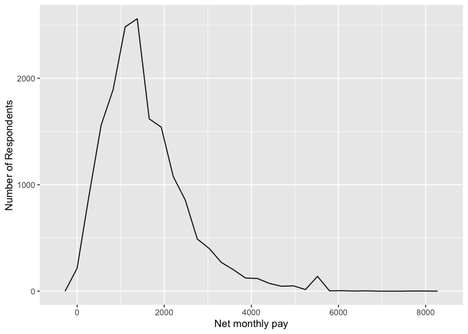
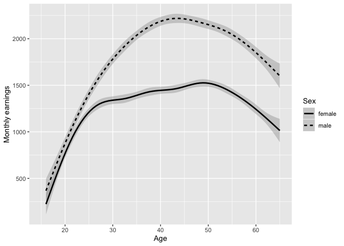
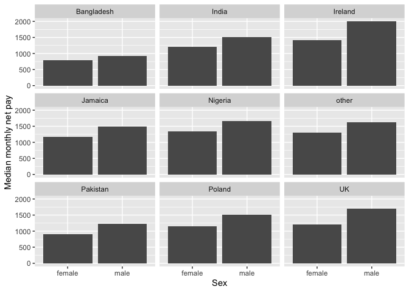
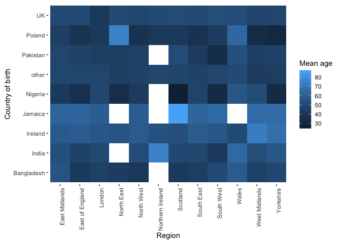
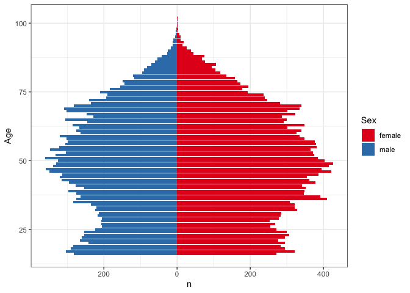

Statistical assignment 4
================
Olivia Mason Pearson
29/02/2020

In this assignment you will need to reproduce 5 ggplot graphs. I supply
graphs as images; you need to write the ggplot2 code to reproduce them
and knit and submit a Markdown document with the reproduced graphs (as
well as your .Rmd file).

First we will need to open and recode the data. I supply the code for
this; you only need to change the file paths.

    ```r
    library(tidyverse)
    Data8 <- read_tsv("/Users/LIV/Desktop/DATA ANALYSIS/DATA ANALYSIS III/UKDA-6614-tab/tab/ukhls_w8/h_indresp.tab")
    Data8 <- Data8 %>%
        select(pidp, h_age_dv, h_payn_dv, h_gor_dv)
    Stable <- read_tsv("/Users/LIV/Desktop/DATA ANALYSIS/DATA ANALYSIS III/UKDA-6614-tab/tab/ukhls_wx/xwavedat.tab")
    Stable <- Stable %>%
        select(pidp, sex_dv, ukborn, plbornc)
    Data <- Data8 %>% left_join(Stable, "pidp")
    rm(Data8, Stable)
    Data <- Data %>%
        mutate(sex_dv = ifelse(sex_dv == 1, "male",
                           ifelse(sex_dv == 2, "female", NA))) %>%
        mutate(h_payn_dv = ifelse(h_payn_dv < 0, NA, h_payn_dv)) %>%
        mutate(h_gor_dv = recode(h_gor_dv,
                         `-9` = NA_character_,
                         `1` = "North East",
                         `2` = "North West",
                         `3` = "Yorkshire",
                         `4` = "East Midlands",
                         `5` = "West Midlands",
                         `6` = "East of England",
                         `7` = "London",
                         `8` = "South East",
                         `9` = "South West",
                         `10` = "Wales",
                         `11` = "Scotland",
                         `12` = "Northern Ireland")) %>%
        mutate(placeBorn = case_when(
                ukborn  == -9 ~ NA_character_,
                ukborn < 5 ~ "UK",
                plbornc == 5 ~ "Ireland",
                plbornc == 18 ~ "India",
                plbornc == 19 ~ "Pakistan",
                plbornc == 20 ~ "Bangladesh",
                plbornc == 10 ~ "Poland",
                plbornc == 27 ~ "Jamaica",
                plbornc == 24 ~ "Nigeria",
                TRUE ~ "other")
        )
    ```

Reproduce the following graphs as close as you can. For each graph,
write two sentences (not more\!) describing its main message.

1.  Univariate distribution (20 points).
    
    ``` r
    ggplot(Data, aes(x = h_payn_dv)) +
        geom_freqpoly() +
        labs(x = "Net monthly pay", y = "Number of Respondents")
    ```
    
    <!-- -->

Interpretation = With a positive skew in distribution, most respondents’
monthly earnings fall between £1000 and £2000, which is pretty low.
Little respondents earn more than £4000 per month, other than a small
increase between £5000-£6000.

2.  Line chart (20 points). The lines show the non-parametric
    association between age and monthly earnings for men and women.
    
    ``` r
    ggplot(Data, aes(x = h_age_dv, y = h_payn_dv, linetype = sex_dv)) +
    geom_smooth(aes(group = sex_dv), colour = "black") +
    xlim(15, 65) +
    labs(x = "Age", y = "Monthly earnings", linetype = "Sex")
    ```
    
    <!-- -->

Interpretation = It is clear that men consistently earn more than women
throughout their working careers, with men peaking between 40 and 45
with about £2250 per month, and women peaking slightly later between 45
and 50 with just £1500 per month, with both genders decreasing after
this point. These trends could be explained by women taking maternity
leave so being out of work for some time and rejoining their job later
on, as well as their tendency to take up part-time work after giving
birth.

3.  Faceted bar chart (20 points).
    
    ``` r
    AgeSexIncome <- Data %>%
        filter(!is.na(sex_dv), !is.na(placeBorn), !is.na(h_age_dv)) %>%
        group_by(placeBorn, sex_dv) %>%
        summarise(medianIncome = median(h_payn_dv, na.rm=TRUE))
    
    ggplot(AgeSexIncome, aes(x=sex_dv, y = medianIncome)) +
    geom_bar(stat = "identity") +
           facet_wrap(~ placeBorn) +
    labs(x = "Sex", y = "Median monthly net pay")
    ```
    
    <!-- -->

Interpretation = Most countries have similar monthly earnings, at around
£1500 or men and around £1000 for women, which suggests that pay
disparities by gender are universal and not defined by
ethnicity/culture. Bangladesh and Pakistan have notably less earnings
per month regardless of gender, and men born in Ireland tend to have a
larger median monthly pay of £2000.

4.  Heat map (20 points).
    
    ``` r
    library(ggplot2)
    AgeBornRegion <- Data %>%
        filter(!is.na(h_gor_dv), !is.na(placeBorn), !is.na(h_age_dv)) %>%
        group_by(placeBorn, h_gor_dv) %>%
        summarise(meanAge = mean(h_age_dv, na.rm=TRUE))
    
     ggplot(AgeBornRegion, aes(x = h_gor_dv, y = placeBorn, fill = meanAge)) +
     geom_tile() +
     theme(axis.text.x = element_text(angle = 90, hjust = 1)) +
     coord_fixed() +
     labs( x = "Region", y = "Country of birth", fill = "Mean age") +
     theme(panel.grid.major = element_blank(), panel.grid.minor = element_blank(),
    panel.background = element_blank())
    ```
    
    <!-- -->

Interpretation = a few cells have no data, such as those born in
Pakistan living in Northern Ireland, however this map clearly shows
disparity in age depending on where a respondent was born and where in
the UK they live, with Scotland having the largest variation. Those born
in Nigeria living in Scotland have the youngest mean age, under 30, with
those born in Jamaica living in Scotland having the oldest mean age of
over 80.

5.  Population pyramid (20 points).
    
    ``` r
    Data <- Data %>%
    filter(!is.na(h_age_dv), !is.na(sex_dv))
    
    ggplot(Data, aes(x = h_age_dv, fill = sex_dv)) +
    geom_bar(data =subset(Data, Data$sex_dv == "female")) + 
        geom_bar(data = subset(Data, Data$sex_dv == "male"), aes(y=..count..*(-1))) +
        coord_flip() +
        scale_y_continuous(breaks=seq(-400,400,200), labels = abs(seq(-400,400,200))) + # ensures no negative values on x axis
        scale_fill_brewer(palette = "Set1") +
        labs(x = "Age", y = "n", fill = "Sex") +
        theme_bw()
    ```
    
    <!-- -->

Interpretation = from this population pyramid, most respondents seem to
be middle aged, falling between 40 and 55. There tend to be more females
than males overall, with over 400 respondents for some ages, however
both share the same trends, with a dip in respondents around 25 years
old, as well as both decreasing in numbers around 75 years old.
